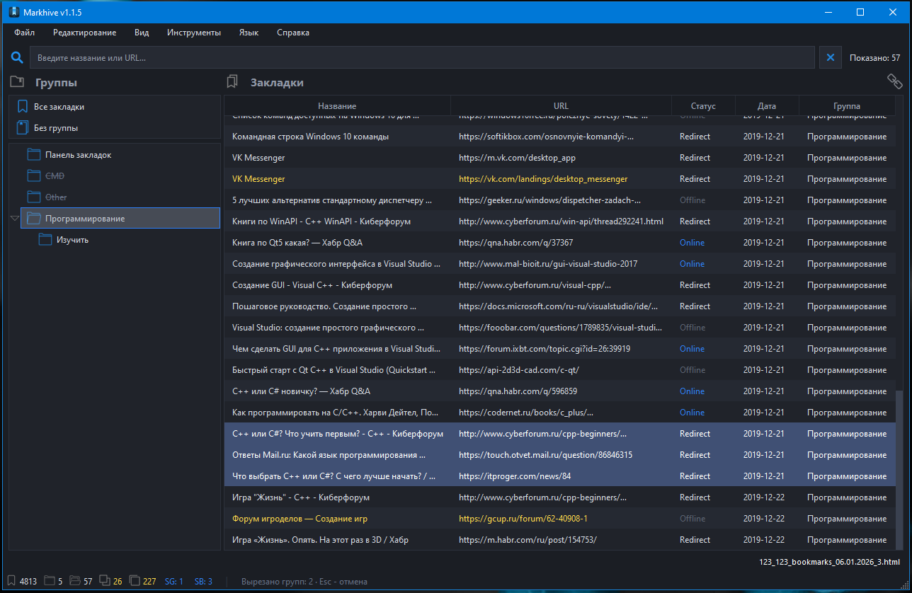

<div align="right">
  <a href="README_EN.md">English</a> | <b>Русский</b>
</div>

<p align="center">
  
</p>

<div align="center">
<h1>Markhive</h1>

**Менеджер закладок браузера.**
Для быстрого наведения порядка.

</div>

<p align="center">
  
  
  
  
  
</p>

**Markhive** - десктопный менеджер закладок браузера для работы с вашей коллекцией сохранённых сайтов. Программа поддерживает импорт стандартных файлов экспорта в формате Netscape HTML из Chrome, Firefox, Edge, Opera и других браузеров. Для работы не требуется привязка к конкретному профилю или установленному браузеру. С помощью менеджера вы сможете выполнять базовые операции с закладками и папками: создавать, перемещать, переименовывать и удалять элементы, выстраивая чёткую и организованную структуру хранения.

---

### Возможности
- **Управление закладками и папками.** Создание, перемещение, переименование, редактирование и удаление - все базовые операции доступны в несколько кликов;
- **Поиск и удаление дубликатов.** Находите повторяющиеся закладки по адресу или названию в один клик. При желании дубликаты можно не удалять, а перенести в отдельную папку;
- **Слияние файлов экспорта.** Объединяйте несколько файлов в единую коллекцию: папки с одинаковыми названиями будут автоматически объединены;
- **Быстрый поиск.** Ищите закладки по названию и адресу в текущей папке. Переключайтесь между папками без необходимости вводить запрос заново;
- **Проверка доступности ссылок.** Узнайте статус каждой ссылки: работает, не отвечает или ведёт на другой адрес (перенаправление). Можно проверить как отдельные группы, так и все сразу;
- **Перемещение папок.** Вырезайте и вставляйте папки между любыми уровнями структуры;
- **Автогруппировка по домену.** Автоматически распределяйте закладки по папкам на основе домена сайта;
- **Наведение порядка.** Разгруппировывайте одиночные или все папки сразу, а также удаляйте пустые папки в один клик.

<p align="center">
  
</p>

### Особенности
- **Автономность** - не требует установки на Windows, работает с флешки и не оставляет мусор в папке Temp;
- **Независимость от браузера** - работает с файлами, а не с профилями Chrome, Firefox, Edge и др;
- **Потоковый парсер** - чтение файлов по 1 МБ позволяет обрабатывать экспорты на десятки тысяч закладок без исчерпания памяти;
- **Итеративная запись** - явный стек вместо рекурсии исключает переполнение при вложенности 50+ уровней;
- **Кеширование нормализованных ключей** — поиск дубликатов и фильтрация работают за O(1) на сравнение.

---

### Горячие клавиши

#### Файл

| Комбинация | Действие |
|---|---|
| `Ctrl+O` | Открыть файл экспорта |
| `Ctrl+Shift+O` | Открыть папку с файлами и слить |
| `Ctrl+S` | Сохранить |
| `Ctrl+Shift+S` | Сохранить как |
| `Ctrl+Q` | Выход |

#### Редактирование

| Комбинация | Действие |
|---|---|
| `Ctrl+Shift+G` | Новая группа (папка) |
| `Ctrl+Alt+G` | Новая подгруппа |
| `Ctrl+N` | Новая закладка |
| `F2` | Переименовать группу |
| `Ctrl+E` | Редактировать закладку |
| `Ctrl+Shift+Del` | Удалить группу |
| `Delete` | Удалить выбранные закладки |
| `Ctrl+X` | Вырезать группы |
| `Ctrl+V` | Вставить группы |

#### Вид

| Комбинация | Действие |
|---|---|
| `Ctrl++` | Развернуть все папки |
| `Ctrl+-` | Свернуть все папки |

#### Инструменты

| Комбинация | Действие |
|---|---|
| `Ctrl+T` | Сортировка закладок |
| `Ctrl+Shift+T` | Сортировка групп |
| `Ctrl+G` | Автогруппировка по домену |
| `Ctrl+Shift+U` | Разгруппировка одиночных папок |
| `Ctrl+Alt+U` | Разгруппировка всех папок |
| `Ctrl+D` | Удаление дубликатов по адресу |
| `Ctrl+Shift+D` | Удаление дубликатов по названию |
| `Ctrl+Alt+D` | Группировка дубликатов в папку |
| `Ctrl+U` | Проверка доступности адресов |
| `Ctrl+Shift+P` | Удаление пустых папок |

#### Прочее

| Комбинация | Действие |
|---|---|
| `Ctrl+F` | Фокус на поле поиска |
| `Esc` | Отмена режима перемещения / вырезки |
| `F1` | Справка по горячим клавишам |

---

### Установка
Скачайте **Markhive.exe** последней версии со страницы Release в удобное для вас место на Windows и запустите.
<p align="left">
  <a href="https://github.com/Darkvayt/Markhive/releases/latest">
    
  </a>
</p>

---

### Краткое руководство
**Структура приложения**
```bash
markhive/
├── main.py              # Точка входа приложения
├── __init__.py          # Метаданные (имя, версия, автор)
├── main_window.py       # Главное окно: логика, файлы, инструменты, проверка URL
├── ui_window.py         # Конструктор интерфейса: виджеты, меню, статус-бар
├── table_model.py       # Модель таблицы закладок (QAbstractTableModel)
├── dialogs.py           # Диалоговые окна (закладка, горячие клавиши, о программе)
├── models.py            # Модели данных: Bookmark, Folder и утилиты обхода
├── bookmark_io.py       # Чтение, слияние и запись файлов Netscape HTML
├── lang.py              # Локализация: загрузка JSON-словарей, функция tr()
├── theme.py             # Тёмная тема: палитра Fusion + QSS
├── icons/               # Иконки интерфейса (.ico)
├── lang/                # Языковые словари (.json)
└── translations/        # Системные переводы Qt (qtbase_*.qm)
```
**Открытие проекта и запуск из исходников**
Проект использует пакетный менеджер `uv` для удобной организованности.
```bash
git clone https://github.com/Darkvayt/Markhive.git
cd Markhive
pip install uv
uv sync
uv run python src/markhive/main.py
```
**Как добавить новый язык интерфейса**
Структура словаря `*.json`
```bash
{
  "language_name": "Русский",
  ...
  "menu.tools.sort_bookmarks": "Упорядочить закладки",
  "menu.tools.sort_groups": "Упорядочить группы",
  "menu.tools.auto_group": "Автогруппировка по домену",
  ...
}
```
| Ключ | Значение |
|---|---|
| `"language_name":` | "Русский" |
| `"menu.tools.sort_bookmarks":` | "Упорядочить закладки" |


1. Скопируйте существующий файл словаря из папки `lang/` (например, `en.json`) и переименуйте его в `<код_языка>.json` (например, `ru.json`, `de.json`).
2. Переведите значения всех ключей в новом файле.
3. Добавьте или измените ключ `"language_name"` - это имя, которое будет отображаться в меню выбора языка.
4. Поместите файл в папку `lang/`.
5. Запустите программу - новый язык автоматически появится в меню **Вид → Язык**.

**Сборка в EXE**
Для автономности сборка производиться пакетом `nuitka`.
```bash
cd Markhive
uv add nuitka
build.bat
```
### Лицензия
Проект распространяется под лицензией **MIT**.
