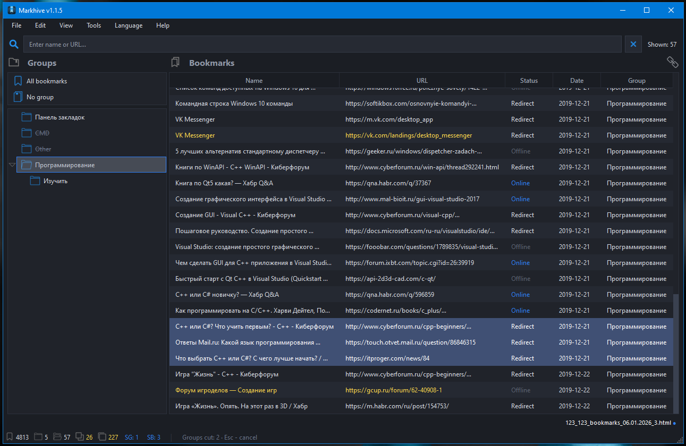

<div align="right">
  <a href="README.md">Русский</a> | <b>English</b>
</div>

<p align="center">
  
</p>

<div align="center">
<h1>Markhive</h1>

**Browser bookmark manager.**<br>For quickly tidying up.

</div>

<p align="center">
  
  
  
  
  
</p>

**Markhive** - A desktop browser bookmark manager for managing your collection of saved websites. The program supports importing standard export files in Netscape HTML format from Chrome, Firefox, Edge, Opera, and other browsers. It does not require linking to a specific profile or an installed browser. The manager allows you to perform basic operations with bookmarks and folders-such as creating, moving, renaming, and deleting items-to establish a clear and organized storage structure.

---

### Possibilities
- **Bookmark and folder management.** Create, move, rename, edit, and delete—all basic operations are available in just a few clicks;
- **Duplicate search and removal.** Find duplicate bookmarks by URL or title with a single click. Optionally, move duplicates to a separate folder instead of deleting them;
- **Merge export files.** Combine multiple files into a single collection; folders with identical names will be merged automatically;
- **Quick search.** Search for bookmarks by title and URL within the current folder. Switch between folders without re-entering your search query;
- **Link availability check.** Check the status of each link: active, unresponsive, or redirected. You can check specific groups or the entire collection at once;
- **Folder moving.** Cut and paste folders between any levels of the structure;
- **Automatic grouping by domain.** Automatically organize bookmarks into folders based on the website domain;
- **Organization and cleanup.** Ungroup individual folders or all folders at once, and delete empty folders with a single click.

<p align="center">
  
</p>

### Peculiarities
- **Portability** — requires no Windows installation, runs from a flash drive, and leaves no junk files in the Temp folder;
- **Browser independence** — works with files rather than Chrome, Firefox, or Edge profiles;
- **Streaming parser** — reading files in 1 MB chunks allows for processing exports containing tens of thousands of bookmarks without running out of memory;
- **Iterative writing** — uses an explicit stack instead of recursion, preventing stack overflow errors with nesting depths exceeding 50 levels;
- **Normalized key caching** — duplicate detection and filtering operate with O(1) complexity per comparison.

---

### Keyboard Shortcuts

#### File

| Shortcut | Action |
|---|---|
| `Ctrl+O` | Open export file |
| `Ctrl+Shift+O` | Open folder and merge files |
| `Ctrl+S` | Save |
| `Ctrl+Shift+S` | Save as |
| `Ctrl+Q` | Exit |

#### Edit

| Shortcut | Action |
|---|---|
| `Ctrl+Shift+G` | New group (folder) |
| `Ctrl+Alt+G` | New subgroup |
| `Ctrl+N` | New bookmark |
| `F2` | Rename group |
| `Ctrl+E` | Edit bookmark |
| `Ctrl+Shift+Del` | Delete group |
| `Delete` | Delete selected bookmarks |
| `Ctrl+X` | Cut groups |
| `Ctrl+V` | Paste groups |

#### View

| Shortcut | Action |
|---|---|
| `Ctrl++` | Expand all folders |
| `Ctrl+-` | Collapse all folders |

#### Tools

| Shortcut | Action |
|---|---|
| `Ctrl+T` | Sort bookmarks |
| `Ctrl+Shift+T` | Sort groups |
| `Ctrl+G` | Auto-group by domain |
| `Ctrl+Shift+U` | Ungroup single-item folders |
| `Ctrl+Alt+U` | Ungroup all folders |
| `Ctrl+D` | Remove duplicates by URL |
| `Ctrl+Shift+D` | Remove duplicates by title |
| `Ctrl+Alt+D` | Group duplicates into a folder |
| `Ctrl+U` | Check URL availability | | `Ctrl+Shift+P` | Delete empty folders |

#### Other

| Shortcut | Action |
|---|---|
| `Ctrl+F` | Focus search field |
| `Esc` | Cancel move/cut mode |
| `F1` | Keyboard shortcuts help |

---

### Installation
Download the latest version of **Markhive.exe** from the Releases page to a location of your choice on Windows and run it.
<p align="left">
  <a href="https://github.com/Darkvayt/Markhive/releases/latest">
    
  </a>
</p>

---

### Quick Start Guide
**Application Structure**
```bash
markhive/
├── main.py              # Application entry point
├── __init__.py          # Metadata (name, version, author)
├── main_window.py       # Main window: logic, file handling, tools, URL validation
├── ui_window.py         # UI layout: widgets, menus, status bar
├── table_model.py       # Bookmark table model (QAbstractTableModel)
├── dialogs.py           # Dialog windows (bookmark, hotkeys, about)
├── models.py            # Data models: Bookmark, Folder, and traversal utilities
├── bookmark_io.py       # Reading, merging, and writing Netscape HTML files
├── lang.py              # Localization: JSON dictionary loading, tr() function
├── theme.py             # Dark theme: Fusion palette + QSS
├── icons/               # UI icons (.ico)
├── lang/                # Language dictionaries (.json)
└── translations/        # Qt system translations (qtbase_*.qm)
```
**Opening the project and launching from source**<br>The project uses the `uv` package manager for organized management.
```bash
git clone https://github.com/Darkvayt/Markhive.git
cd Markhive
pip install uv
uv sync
uv run python src/markhive/main.py
```
**How ​​to add a new interface language**<br>`*.json` dictionary structure
```bash
{
  "language_name": "English",
...
"menu.tools.sort_bookmarks": "Sort bookmarks",
"menu.tools.sort_groups": "Sort groups",
"menu.tools.auto_group": "Auto-group by domain",
...
}
```
| Key | Value |
|---|---|
| `"language_name":` | "English" |
| `"menu.tools.sort_bookmarks":` | "Sort bookmarks" |


1. Copy an existing dictionary file from the `lang/` folder (e.g., `en.json`) and rename it to `<language_code>.json` (e.g., `ru.json`, `de.json`).
2. Translate the values ​​for all keys in the new file.
3. Add or modify the `"language_name"` key—this is the name that will appear in the language selection menu.
4. Place the file in the `lang/` folder.
5. Launch the program—the new language will automatically appear in the **View → Language** menu.

**Building into an EXE**<br>To ensure standalone operation, the build is performed using the `nuitka` package.
```bash
cd Markhive
uv add nuitka
build.bat
```
### License
The project is distributed under the **MIT** license.
